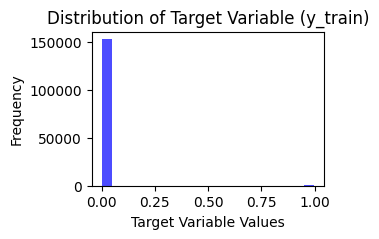

#  Advanced Predictive Modeling and Sentiment Analysis for Corporate Default Risk in Financial Data
 
Employing cutting-edge advancements in Machine Learning (ML) and Natural Language Processing (NLP), we endeavor to develop a sophisticated model for predicting the likelihood of a company facing bankruptcy based on a comprehensive analysis of its financial and stock market data.

## INTRODUCTION

At the core of our methodology lies a meticulous exploration of cutting-edge machine learning paradigms, delving into ensemble methods, deep neural networks, and sophisticated feature engineering techniques. The financial and stock market data undergoes meticulous preprocessing, including normalization, outlier detection, and time-series decomposition. Through this rigorous preparation, we seek to unravel intricate patterns and latent signals indicative of a company's financial trajectory.

Once the optimal predictive model is identified, the narrative extends beyond binary classification. Leveraging these predictions, we embark on a deeper analysis by extracting the 10-K data of companies flagged for financial turbulence. Here, the innovative application of FinBERT, a state-of-the-art financial sentiment analysis model, further refines our understanding, shedding light on the nuanced linguistic cues embedded in financial disclosures.

In essence, this project represents a convergence of financial acumen and machine learning sophistication, pioneering a proactive approach to safeguard investments through predictive analytics and insightful sentiment analysis.

## DATASET 
 * Stock Market Monthly Data - A robust dataset exceeding 3 million+ rows encapsulates monthly stock market details for diverse companies. Essential features include the CUSIP, a key identifier for companies, alongside stock price, stock return, and bid and ask prices. 
 * Comp Stat Data - Comprising over half a million rows, the Comp Stat Data presents a structured 10-K dataset for various companies. Organized in a tabular format, it encompasses crucial features such as revenue, market-to-book ratio, net income, and working capital. 
 * BR1964-2019 - The BR1964-2019 dataset amalgamates information on companies that faced bankruptcy between 1964 and 2019, cataloged on an annual basis.

## FEATURES 
   - MARKET_TO_BOOK
   - NET INCOME 
   - ANNUAL STOCK MARKET RETURN 
   - DEBT_TO_EQUITY_RATIO
   - ROE, ROA
   - ANNUAL SIGMAE
   - ACCOUNTS_RECEIVABLE
   - ATLMAN_SCORE
   - ACCOUNTS_PAYABLE
   - TRAILING_2_YR_REVENUES
   - WORKING_CAPITAL
   - ASSET_TURNOVER

## PROCEDURE

 * Confronted with a glaring class imbalance in the dataset (initially at 96:4), I strategically implemented the Synthetic Minority Over-sampling Technique (SMOTE) to rectify the skewed distribution. By reducing instances of the majority class and increasing those of the minority class, the class ratio transformed significantly to a more balanced 55:45. This meticulous rebalancing, critical for mitigating biases, aimed to prevent machine learning algorithms from learning arbitrary classification trends influenced by the dominant class. The adjusted dataset, now offering a more equitable representation, fostered a robust training environment, enhancing the algorithms' ability to discern patterns and make more accurate predictions.

            
 
 * Upon merging and rectifying class imbalances, hyperparameter tuning was meticulously applied across diverse machine learning algorithms within the project. This process aimed to optimize the performance of each model by fine-tuning hyperparameters. The evaluation metrics, including accuracy and AUC score, were scrutinized to discern the model exhibiting superior performance. Notably, the XGBoost model emerged as the preeminent performer, boasting an accuracy rate of 84.72% and an AUC score of 0.817.

* Upon refining predictions using XGBoost, a meticulously curated list of companies exhibiting potential financial distress was compiled. Subsequently, FinBERT, an advanced sentiment analysis model, was employed on the 10-K reports of these companies. Leveraging the natural language processing capabilities of nltk for sentence tokenization, and incorporating the powerful pre-trained models from Hugging Face's transformers library, specifically using AutoTokenizer and AutoModelForSequenceClassification, this sophisticated analysis delved into the intricate linguistic nuances of pre-bankruptcy disclosures. The seamless integration of FinBERT's insights enriched the overall analytical framework, employing advanced techniques in natural language processing and sentiment analysis, thereby yielding a more nuanced and comprehensive understanding of the intricate financial landscape preceding potential bankruptcies.

## RESULTS

The performance evaluation of the nine machine learning and deep learning models culminated in a comprehensive summary. Upon scrutinizing both accuracy and AUC scores, XGBoost emerged as the superior model. The predictions generated by XGBoost were subsequently employed to compile a list of companies susceptible to bankruptcy on an annual basis. 

 

Conducting sentiment analysis, I implemented the FinBERT model on a cohort of 400+ companies exhibiting a probability of financial distress. Analyzing 4-5 pre-bankruptcy 10-K reports, I extracted nuanced trends in negative, neutral, and positive sentiments. Evident in the graphs, an observable pattern emerged, showcasing an average 0.26% augmentation in the negative sentiment score as companies progressed towards bankruptcy across temporal iterations. This discerning analysis underscores the utility of FinBERT in unveiling subtle linguistic shifts within financial disclosures, providing valuable insights into the evolving sentiment landscape preceding financial distress.

 

 